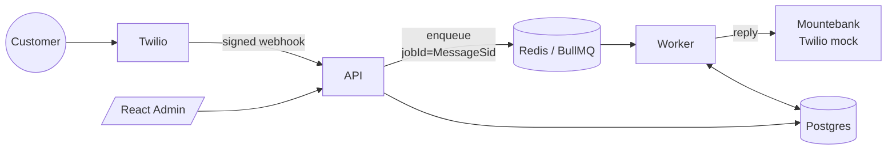

# SMS Messaging System

A conversational SMS system: a customer texts in, the backend processes the
message asynchronously (3–15s) and replies via SMS, and an admin web UI shows the
conversation histories with live message status.

Built around one hard constraint — **Twilio's webhook times out at 5s but
processing takes 3–15s** — so ingest and processing are fully decoupled, with
idempotency, ordering, and no message loss. Full rationale in
**[docs/ARCHITECTURE.md](./docs/ARCHITECTURE.md)**.

## Stack

React + TypeScript · Fastify · Postgres (Drizzle) · Redis (BullMQ) · clean
architecture · Docker Compose · Mountebank (Twilio mock) · Vitest + Playwright.

## How it works (1 minute)



- **API hot path** = parse + one Redis enqueue + ack (empty TwiML `200`). No DB →
  the 5s budget is never at risk.
- **Worker** persists (dedup on `provider_sid`), enforces per-conversation
  ordering (Redis lock + head check), simulates 3–15s, generates and sends the
  reply, and records every status transition.
- **Idempotency**: queue jobId + unique `provider_sid` (receive) and the reply
  link (send). **No loss** via durable Redis (AOF) + BullMQ retries/stalled-job
  recovery. **Ordering** via a per-conversation lock + head check.

## Repository layout

```
backend/      Fastify API + BullMQ worker (one image, two entrypoints), clean arch
frontend/     React + Vite admin UI (nginx)
twilio-mock/  Mountebank imposter for the Twilio Messages API
e2e/          Playwright end-to-end tests
scripts/      send-sms.mjs — signed inbound-SMS simulator
docs/         ARCHITECTURE.md (design + diagrams)
docker-compose.yml · Makefile · .env.example
```

Each service has its own `README.md` and Docker config and is independently
deployable.

## Run it

```bash
make up                 # build + start the whole stack (creates .env from .env.example)
make migrate            # apply DB migrations (also runs automatically on boot)
```

| Service           | URL                              |
|-------------------|----------------------------------|
| Admin UI          | http://localhost:8080            |
| API               | http://localhost:3000 (`/health`, `/ready`) |
| Mountebank admin  | http://localhost:2525            |

> If host ports 3000/5432/6379 are busy, override `API_HOST_PORT`,
> `POSTGRES_PORT`, `REDIS_PORT` in `.env`.

### Try the round trip

```bash
make send-sms FROM=+15551112222 BODY="hello there"   # simulate a customer SMS
make logs-worker                                     # watch received -> processing -> sent
make sent                                            # what the worker sent to the Twilio mock
```

Then open the Admin UI — the conversation appears and the reply's status moves to
`sent` live.

## Test

```bash
make test     # backend unit + integration (real Postgres + Redis when up)
make e2e      # Playwright e2e against the running stack
```

## Key endpoints

```
POST /webhooks/twilio/sms            inbound (returns empty TwiML 200)
GET  /api/v1/conversations           list
GET  /api/v1/conversations/:id       conversation + messages
GET  /health · /ready                liveness · readiness
```
