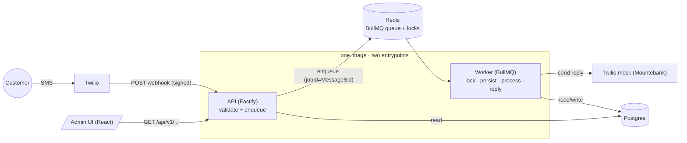
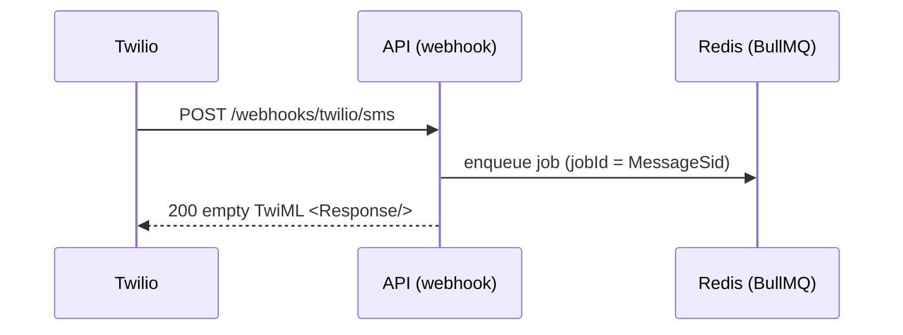
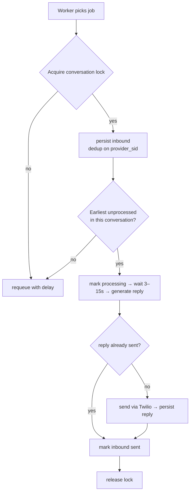
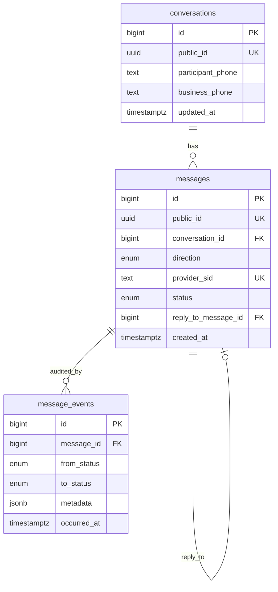

# Architecture & Design

Conversational SMS system: a customer texts in, the system processes the message
(3–15s) and replies via SMS, and an admin web UI shows conversation histories.

The whole design is driven by one constraint: **Twilio's webhook times out at 5s,
but processing takes 3–15s.** Everything below follows from decoupling those two.

---

## 1. System overview



Services deploy independently: `backend-api`, `backend-worker` (same image,
different entrypoint — scale workers separately), `frontend`, `mountebank`,
`postgres`, `redis`.

**Clean architecture** in the backend: `domain ← application ← infrastructure`.
Domain and use cases depend only on **port interfaces**; concrete adapters
(Drizzle, BullMQ, Fastify, Twilio, pino) are wired in one composition root. This
keeps business logic framework-free and unit-testable against in-memory fakes.

---

## 2. The 5-second timeout strategy

The webhook handler does the minimum and returns fast:



- **No heavy work on the hot path** — parse and enqueue, then ack with an empty
  TwiML `200`. The 5s budget is never at risk.
- All processing (the 3–15s, the reply send) happens **asynchronously in the
  worker**.

> Note: Twilio webhook **signature validation** (`X-Twilio-Signature`) is left out
> on purpose — it's not needed for this test/mock setup. In production it's a small
> middleware on this route (HMAC-SHA1 over the URL + sorted params).

---

## 3. Async processing (worker)

One job carries one inbound message through a linear, idempotent flow:



Concurrency is configurable (`WORKER_CONCURRENCY`) and different conversations
process in parallel; add worker replicas to scale throughput.

---

## 4. Idempotency / duplicate prevention

Twilio delivers at-least-once, so duplicates are expected.

- **Receive (durable):** `messages.provider_sid` is `UNIQUE`; the worker inserts
  with `ON CONFLICT (provider_sid) DO NOTHING`. One inbound row per MessageSid, no
  matter how often it's delivered. (`jobId = MessageSid` also drops most duplicate
  jobs at the queue — a fast path; the DB constraint is the durable guarantee.)
- **Send:** an outbound reply links to its inbound via `reply_to_message_id`.
  Before sending, the worker checks for an existing reply and skips if present —
  so a retried job doesn't text the customer twice.

---

## 5. Message ordering

Within a conversation messages must be handled in receive-order, but a naive queue
+ concurrent workers can reorder them. Two mechanisms combine:

- A **per-conversation Redis lock** serializes processing; other conversations run
  in parallel.
- A **head check**: the worker only processes a message if it is the earliest
  unprocessed inbound in its conversation (ordered by `createdAt` = webhook receive
  time); otherwise it requeues with a short delay. So even if jobs are picked out
  of order, replies go out in order.

---

## 6. Message persistence (no loss)

- **Durable queue:** Redis AOF (`appendonly`) persists enqueued jobs across a
  restart; `jobId = MessageSid` keeps re-enqueues from duplicating.
- **Automatic retries:** BullMQ retries failed jobs with exponential backoff and
  re-delivers **stalled** jobs (a worker that crashes mid-process), so an inbound
  isn't dropped because a worker died.
- **Idempotent reprocessing:** every retry is safe (provider_sid dedup +
  reply_to send check), so re-delivery never double-persists or double-sends.
- **Audit trail:** `message_events` records every status transition (append-only).

> Residual risk: a job is durable in Redis (fsync'd) before the `200`, but a
> catastrophic single-node Redis loss before the worker persists leaves no DB
> trace — closed in production by the outbox / HA-Redis options in §11.

---

## 7. Data model



- **BIGINT identity PKs**, not UUID PKs: sequential locality keeps indexes, joins
  and sorts fast (random UUID PKs fragment B-trees and bloat FKs).
- **Indexed `public_id` (UUID)** is the only id exposed over the API — data isn't
  guessable or enumerable. The HTTP edge maps `public_id ↔ id`.
- **`provider_sid UNIQUE`** is the idempotency key.
- **Ordering** uses `created_at` (the webhook receive time) with `id` as a tiebreak —
  no separate sequence column needed. Conversations sort by `updated_at` (bumped on
  each new message).
- **Postgres** over Mongo/Redis-as-store: relational data, unique constraints for
  idempotency, transactional writes. Redis is used for the queue + locks, not for
  durable record storage.

---

## 8. Status lifecycle

```
inbound:  received → processing → sent
outbound: sent
```

Every status change appends a `message_events` row (the audit trail).
`delivered` / `failed` exist in the enum for the delivery-callback handling on
the roadmap (§11).

---

## 9. Observability

- **Structured logging** (pino, JSON) with a `correlationId = MessageSid`
  propagated webhook → job → worker → send.
- **Health/readiness:** `GET /health` (liveness), `GET /ready` (checks Postgres +
  Redis).
- **Audit trail:** every transition is recorded in `message_events`.

---

## 10. Tradeoffs

| Decision | Benefit | Cost |
|---|---|---|
| Decouple via queue | Webhook stays fast; processing scales independently | Eventual (not instant) reply — fine for SMS |
| Lock + head check ordering | Correct order on plain BullMQ, parallel across conversations | Out-of-order jobs requeue (small delay) |
| BIGINT PK + UUID public id | Fast indexes + non-enumerable API | A little id mapping at the edge |
| One image, two entrypoints | No shared-code duplication without a monorepo tool | API + worker share a release cadence |
| Mountebank mock | No Twilio cost/creds; declarative contract | Can't originate inbound → paired with a signing script |

---

## 11. Production roadmap

Natural next steps to take this from a working system to a hardened, high-scale
service:

- **Stronger delivery guarantees (zero loss):** a transactional outbox (persist the
  inbound in the webhook request, relay to the queue separately) or HA Redis with
  `WAIT`-for-replica before acking — closes the small window where an enqueued job
  could be lost on an infra crash.
- **Exactly-once send:** insert the outbound reply *intent* before calling Twilio
  (unique on `reply_to_message_id`) and/or use a provider idempotency key, so a
  crash mid-send can never double-text a customer.
- **Strict cross-arrival ordering at scale:** partition the queue per conversation
  (BullMQ Pro groups, or a partition key in Kafka/Kinesis) and drain a
  conversation under a single lease — removes the requeue step entirely under load.
- **Automated stuck-message recovery:** a periodic sweeper that re-enqueues
  messages stuck in `processing`/`received` past a threshold, complementing BullMQ's
  built-in retry.
- **Metrics & tracing:** Prometheus `/metrics` (throughput, processing latency,
  queue depth, failures) and OpenTelemetry spans across webhook → job → send.
- **Delivery status tracking:** a `/webhooks/twilio/status` callback driving
  `sent → delivered/failed`, treating external status as a monotonic max (and
  always auditing it) so late/duplicate callbacks never regress state.
- **Pagination + audit read API:** cursor/limit paging on `/conversations` and a
  read endpoint for `message_events` once the data volume warrants it.
- **Real Twilio:** point `TWILIO_API_BASE_URL` at `api.twilio.com` with real
  credentials and set the number's webhook URL — no app-code change.
- **Conversational brain:** swap the rule-based `generateReply` for an LLM/dialog
  engine (conversation history is already persisted per conversation).
- **CI/CD pipeline:** GitHub Actions on every PR — lint + typecheck, unit +
  Testcontainers integration + Playwright e2e, build & scan the Docker images,
  push to a registry, run DB migrations, and deploy per environment
  (staging → production) with health-gated rollout and automatic rollback.
