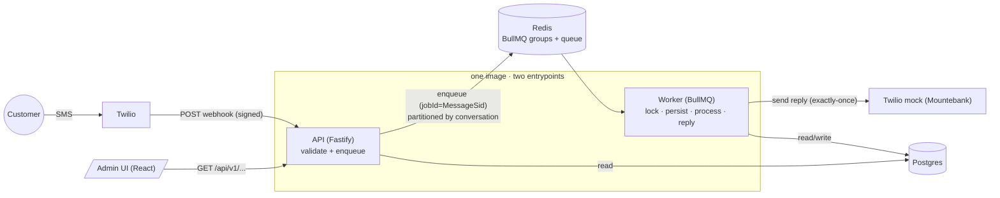
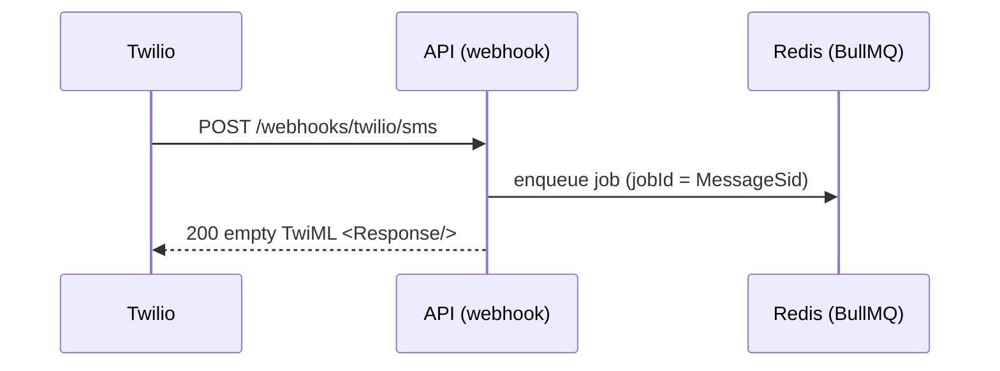
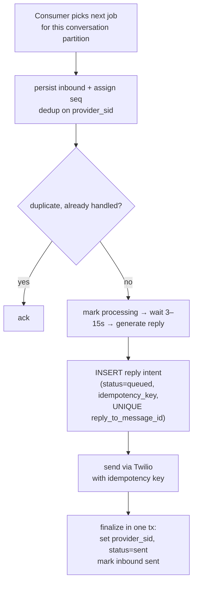
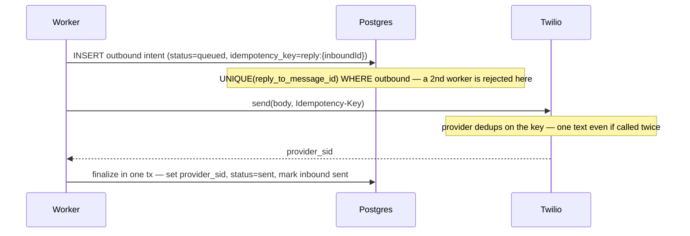
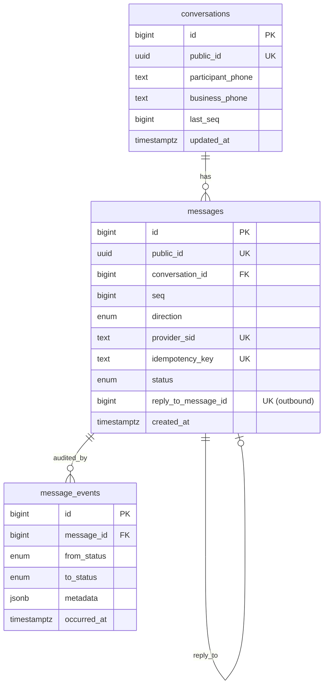

# Architecture & Design

Conversational SMS system: a customer texts in, the system processes the message
(3–15s) and replies via SMS, and an admin web UI shows conversation histories.

The whole design is driven by one constraint: **Twilio's webhook times out at 5s,
but processing takes 3–15s.** Everything below follows from decoupling those two.

---

## 1. System overview



Services deploy independently: `backend-api`, `backend-worker` (same image,
different entrypoint — scale workers separately), `frontend`, `mountebank`,
`postgres`, `redis`.

> **Implementation status.** This document describes the **target production
> design**. The base system (decoupled webhook → queue → worker, receive-side
> idempotency, lock-based ordering, audit trail) is implemented. The
> production-hardening described in **§4 exactly-once send**, **§5 ordering at scale
> + hot conversations**, and the schema fields they introduce (`seq`, `last_seq`,
> `idempotency_key`, the partial uniques, the `queued` status) are the design this
> branch builds toward — where the live code still uses the v1 mechanism (Redis
> lock + head check + requeue) it is called out inline.

**Clean architecture** in the backend: `domain ← application ← infrastructure`.
Domain and use cases depend only on **port interfaces**; concrete adapters
(Drizzle, BullMQ, Fastify, Twilio, pino) are wired in one composition root. This
keeps business logic framework-free and unit-testable against in-memory fakes.

---

## 2. The 5-second timeout strategy

The webhook handler does the minimum and returns fast:



- **No heavy work on the hot path** — parse and enqueue, then ack with an empty
  TwiML `200`. The 5s budget is never at risk.
- All processing (the 3–15s, the reply send) happens **asynchronously in the
  worker**.

> Note: Twilio webhook **signature validation** (`X-Twilio-Signature`) is left out
> on purpose — it's not needed for this test/mock setup. In production it's a small
> middleware on this route (HMAC-SHA1 over the URL + sorted params).

---

## 3. Async processing (worker)

One job carries one inbound message through a linear, idempotent flow. The
conversation **partition** (§5) guarantees only one job per conversation is in
flight, so there is no per-job lock or head check on the hot path:



Concurrency is configurable (`WORKER_CONCURRENCY`) and different conversations
process in parallel; add worker replicas to scale throughput.

> **v1 (current code):** ordering is enforced by a per-conversation Redis lock + an
> earliest-unprocessed head check + busy-requeue, and the reply is sent *before* it
> is persisted (`findReplyTo` guards re-sends). §4 and §5 replace both — intent is
> persisted *before* the send, and the partition removes the lock/head/requeue.

---

## 4. Idempotency & exactly-once send

Twilio delivers at-least-once, so duplicate inbound deliveries are expected — and a
retried job must never text the customer twice.

### Receive (no double-persist)

- **Durable:** `messages.provider_sid` is `UNIQUE`; the worker inserts with
  `ON CONFLICT (provider_sid) DO NOTHING`. One inbound row per MessageSid, no matter
  how often it's delivered.
- **Fast path:** `jobId = MessageSid` collapses most duplicate jobs at the queue.
  The DB constraint is the durable guarantee.

### Send (exactly-once)

Sending a reply is a **dual-write**: call Twilio *and* persist the outbound row. A
crash between the two re-sends on retry and texts the customer twice. We close that
window with **persist-intent-before-send + a provider idempotency key**, guarded by
DB uniqueness:



Every crash window is now safe on retry:

| Crash point | Retry behavior |
|---|---|
| after intent insert, before Twilio | intent row exists → re-call Twilio with same key → finalize |
| after Twilio, before finalize | intent row still `provider_sid=NULL` → re-call same key → provider returns the same message (no 2nd text) → finalize |
| two workers race the same inbound | `UNIQUE(reply_to_message_id)` rejects the second intent insert |

Two DB invariants do the work: a **partial unique on `reply_to_message_id`** (at
most one reply per inbound) and a **unique `idempotency_key`** on outbound rows. The
`SmsProvider.send` port takes an `idempotencyKey` the adapter forwards to the
provider.

> **Twilio caveat.** Twilio's *Create Message* has no first-class idempotency key.
> The DB intent row + uniques already give exactly-once *on our side*; to close the
> provider side either (a) target a provider that supports idempotency keys (the
> port is built for it), or (b) on a retry whose send outcome is unknown, **query
> the provider first** (by our key / `ClientReference`) before re-sending — one
> extra read on the rare retry path.

---

## 5. Ordering at scale

Within a conversation messages must be handled in receive-order; across
conversations they run in parallel. A naive queue + concurrent workers reorders
them.

### Partition the queue per conversation

The queue is **partitioned by the conversation's natural key** (`${To}:${From}` —
known at webhook time, before the conversation row exists). One partition is drained
by a single consumer in FIFO order, so replies leave in receive-order with **no
lock, no head check, no requeue** — ordering becomes structural.

| Option | Mechanism | Cost |
|---|---|---|
| **BullMQ Pro Groups** (recommended — keeps the stack) | `add(job, { group: { id: convKey } })`: one job per group at a time, FIFO within a group, parallel across groups | Pro license; near drop-in |
| **Kafka / Kinesis** | partition by `convKey`; one consumer per partition reads in offset order | heavier infra/ops |

> **v1 (current code):** ordering uses a per-conversation Redis lock + an
> earliest-unprocessed head check + busy-requeue (`process-inbound-message.ts`). It
> is correct on plain BullMQ but spins requeues under load. Partitioning replaces
> all three.

### Hot conversations (high scale)

Partitioning makes each conversation a **single ordered lane**, so a hot number
(shared shortcode, blasted support line) would serialize behind 3–15s per message.
We keep order *and* throughput by separating the **cheap-ordered** step from the
**heavy-parallel** step:

1. **Sequence at ingest (cheap, ordered).** The ingest tx bumps
   `conversations.last_seq` and stamps `messages.seq` (`UNIQUE(conversation_id,
   seq)`). This is the only strictly-serial work — microseconds per message.
2. **Process in parallel (unordered).** Reply generation (a future LLM) fans out
   across all workers regardless of conversation, then writes the reply **intent**
   into the outbox (§4) tagged with its `seq`.
3. **Ordered send via a reorder buffer.** A per-conversation dispatcher sends outbox
   rows in `seq` order (a reply for seq N waits for N-1) using the §4 idempotency
   key — ordered output, parallel processing.

Two multipliers:

- **Burst coalescing.** A short debounce batches a conversation's pending inbounds
  into a single reply — natural for SMS and the biggest hot-conversation win (cuts
  load ~Nx on a burst).
- **Bounded sharding (last resort).** A pathological group past a depth threshold is
  sharded into K sub-lanes by hash → bounded parallelism with a **logged, explicit**
  ordering relaxation (never silent).

These three asks — exactly-once send (§4), ordering at scale, and hot-conversation
throughput — converge on **one spine**: per-conversation `seq` + transactional
outbox + ordered idempotent dispatch. It is built once and serves all three.

---

## 6. Message persistence (no loss)

- **Durable queue:** Redis AOF (`appendonly`) persists enqueued jobs across a
  restart; `jobId = MessageSid` keeps re-enqueues from duplicating.
- **Automatic retries:** BullMQ retries failed jobs with exponential backoff and
  re-delivers **stalled** jobs (a worker that crashes mid-process), so an inbound
  isn't dropped because a worker died.
- **Idempotent reprocessing:** every retry is safe (provider_sid dedup on receive +
  the exactly-once intent/finalize on send, §4), so re-delivery never double-persists
  or double-sends.
- **Audit trail:** `message_events` records every status transition (append-only).

> Residual risk: a job is durable in Redis (fsync'd) before the `200`, but a
> catastrophic single-node Redis loss before the worker persists leaves no DB
> trace. Closed by the **transactional outbox** (the §5 spine — persist the inbound
> in the webhook request, relay to the queue separately) or HA Redis with
> `WAIT`-for-replica before acking.

---

## 7. Data model



- **BIGINT identity PKs**, not UUID PKs: sequential locality keeps indexes, joins
  and sorts fast (random UUID PKs fragment B-trees and bloat FKs).
- **Indexed `public_id` (UUID)** is the only id exposed over the API — data isn't
  guessable or enumerable. The HTTP edge maps `public_id ↔ id`.
- **`provider_sid UNIQUE`** is the receive-side idempotency key.
- **Exactly-once send (§4)** adds a **partial unique on `reply_to_message_id`** (one
  outbound reply per inbound) and a **unique `idempotency_key`** on outbound rows.
- **Ordering (§5)** adds a per-conversation **`messages.seq`** (`UNIQUE(conversation_id,
  seq)`) assigned from a **`conversations.last_seq`** counter at ingest — the stable
  order key for the reorder buffer, independent of clock skew. `created_at` (webhook
  receive time, `id` tiebreak) remains the display/audit order; conversations sort by
  `updated_at` (bumped on each new message).
- **Postgres** over Mongo/Redis-as-store: relational data, unique constraints for
  idempotency, transactional writes. Redis is used for the queue + locks, not for
  durable record storage.

---

## 8. Status lifecycle

```
inbound:  received → processing → sent
outbound: queued → sent            (queued = reply intent persisted, §4)
```

`queued` is the exactly-once intent state: the outbound row exists with its
`idempotency_key` before Twilio is called, and moves to `sent` once the provider
confirms. Every status change appends a `message_events` row (the audit trail).
`delivered` / `failed` exist in the enum for the delivery-callback handling on the
roadmap (§11).

---

## 9. Observability

- **Structured logging** (pino, JSON) with a `correlationId = MessageSid`
  propagated webhook → job → worker → send.
- **Health/readiness:** `GET /health` (liveness), `GET /ready` (checks Postgres +
  Redis).
- **Audit trail:** every transition is recorded in `message_events`.

---

## 10. Tradeoffs

| Decision | Benefit | Cost |
|---|---|---|
| Decouple via queue | Webhook stays fast; processing scales independently | Eventual (not instant) reply — fine for SMS |
| Partition queue per conversation (§5) | Ordering is structural — no lock, head check, or requeue; parallel across conversations | BullMQ Pro license (or Kafka ops) |
| Intent-before-send + idempotency key (§4) | Exactly-once send; a crash can never double-text | Extra write + a `queued` state before each send |
| Split ordered-ingest from parallel-processing (§5) | Hot conversation keeps order *and* throughput | Reorder buffer + outbox machinery |
| BIGINT PK + UUID public id | Fast indexes + non-enumerable API | A little id mapping at the edge |
| One image, two entrypoints | No shared-code duplication without a monorepo tool | API + worker share a release cadence |
| Mountebank mock | No Twilio cost/creds; declarative contract | Can't originate inbound → paired with a signing script |

---

## 11. Production roadmap

**Now in the design (this branch — see [PRODUCTION-HARDENING.md](./PRODUCTION-HARDENING.md)):**

- **Exactly-once send (§4):** insert the outbound reply *intent* before calling
  Twilio (partial unique on `reply_to_message_id`) + a provider idempotency key, so a
  crash mid-send can never double-text a customer.
- **Ordering at scale (§5):** partition the queue per conversation (BullMQ Pro
  groups, or a partition key in Kafka/Kinesis) and drain each conversation under a
  single lease — removes the lock + head check + requeue entirely.
- **Hot-conversation throughput (§5):** split cheap-ordered ingest (`seq`) from
  heavy-parallel processing, re-order on send via the outbox + reorder buffer; plus
  burst coalescing and bounded sharding for pathological groups.

**Further roadmap:**

- **Stronger delivery guarantees (zero loss):** the same transactional outbox
  (persist the inbound in the webhook request, relay to the queue separately) or HA
  Redis with `WAIT`-for-replica before acking — closes the small window where an
  enqueued job could be lost on an infra crash.
- **Automated stuck-message recovery:** a periodic sweeper that re-enqueues
  messages stuck in `processing`/`received` past a threshold, complementing BullMQ's
  built-in retry.
- **Metrics & tracing:** Prometheus `/metrics` (throughput, processing latency,
  queue depth, failures) and OpenTelemetry spans across webhook → job → send.
- **Delivery status tracking:** a `/webhooks/twilio/status` callback driving
  `sent → delivered/failed`, treating external status as a monotonic max (and
  always auditing it) so late/duplicate callbacks never regress state.
- **Pagination + audit read API:** cursor/limit paging on `/conversations` and a
  read endpoint for `message_events` once the data volume warrants it.
- **Real Twilio:** point `TWILIO_API_BASE_URL` at `api.twilio.com` with real
  credentials and set the number's webhook URL — no app-code change.
- **Conversational brain:** swap the rule-based `generateReply` for an LLM/dialog
  engine (conversation history is already persisted per conversation).
- **CI/CD pipeline:** GitHub Actions on every PR — lint + typecheck, unit +
  Testcontainers integration + Playwright e2e, build & scan the Docker images,
  push to a registry, run DB migrations, and deploy per environment
  (staging → production) with health-gated rollout and automatic rollback.
