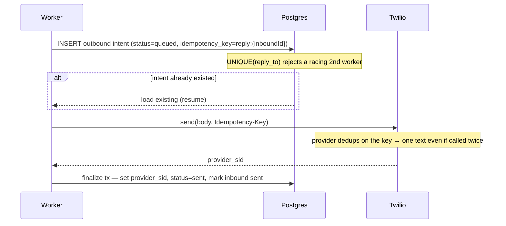
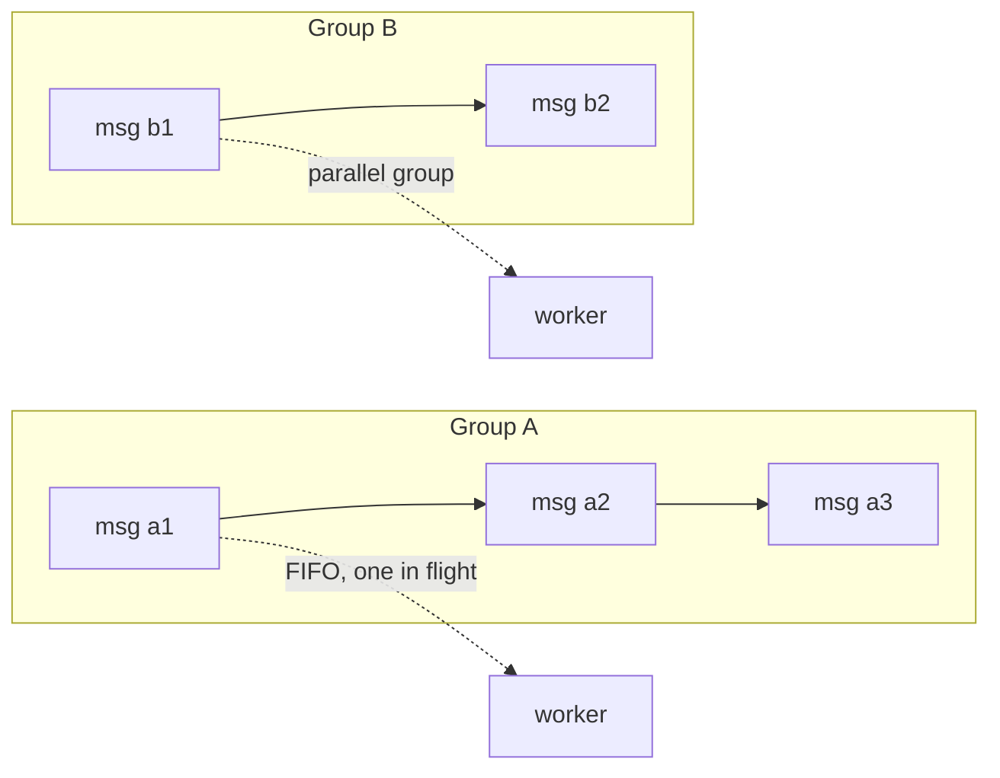
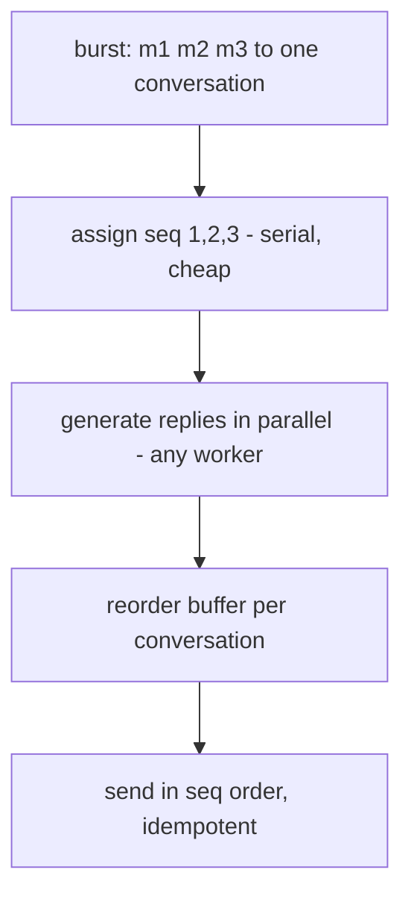

# Production Hardening — Exactly-Once Send · Ordering at Scale · Hot Conversations

This document specifies the production-ready changes the
`feature/production-exactly-once-ordering-hot-scale` branch builds toward. It is the
detailed companion to [`ARCHITECTURE.md`](./ARCHITECTURE.md) §4–§5.

Three asks, **one spine**: a per-conversation sequence + a transactional outbox +
ordered, idempotent dispatch. Build it once; all three are served.

| # | Ask | Core mechanism |
|---|-----|----------------|
| A | Exactly-once send | Persist reply **intent before** the Twilio call + provider idempotency key, guarded by DB uniques |
| B | Ordering at scale | **Partition the queue per conversation** (BullMQ Pro groups / Kafka); drop the lock + head check + requeue |
| C | Hot-conversation throughput | Split **cheap-ordered ingest** (`seq`) from **heavy-parallel processing**, re-order on send; coalesce bursts |

---

## 0. What's wrong today

`backend/src/application/process-inbound-message.ts`:

```
sleep(3–15s)
existingReply = findReplyTo(inbound.id)   // guard
if existingReply -> mark sent, return
sent = sms.send(...)                        // (1) external side effect
recordReply(...)                            // (2) persist + mark sent, one tx
```

**Dual-write bug.** A crash between (1) and (2) leaves the customer texted but no
reply row in the DB. On retry `findReplyTo` returns `null` → **the customer is
texted again**. No DB constraint prevents it (`reply_to_message_id` is not unique).

**Ordering cost.** `inbound-worker.ts` turns a `requeue` outcome into a delayed
re-enqueue; under load an out-of-order or lock-contended hot conversation
busy-requeues, burning queue throughput.

**Hot conversation.** The per-conversation lock serializes a hot number behind
3–15s/message with no path to parallelize.

---

## A. Exactly-once send

### A.1 Schema

```sql
-- new outbound intent state
ALTER TYPE message_status ADD VALUE 'queued' BEFORE 'sent';

-- deterministic provider idempotency key (outbound only)
ALTER TABLE messages ADD COLUMN idempotency_key text;
CREATE UNIQUE INDEX messages_idem_key_uq
  ON messages (idempotency_key) WHERE idempotency_key IS NOT NULL;

-- at most one reply per inbound
CREATE UNIQUE INDEX messages_reply_to_uq
  ON messages (reply_to_message_id) WHERE direction = 'outbound';
```

Drizzle (`backend/src/infrastructure/db/schema.ts`): add `idempotencyKey: text(...)`,
add `'queued'` to `messageStatusEnum`, and the two partial `uniqueIndex(...).where(...)`.

### A.2 Flow



Crash-safety (every window safe on retry):

| Crash point | Retry behavior |
|---|---|
| after intent, before Twilio | intent exists → re-call Twilio (same key) → finalize |
| after Twilio, before finalize | intent `provider_sid=NULL` → re-call (same key) → provider returns same message → finalize |
| two workers race | `UNIQUE(reply_to_message_id)` rejects the 2nd intent |

### A.3 Code shape

`ProcessInboundMessageUseCase.process()` replaces the `findReplyTo → send →
recordReply` block with:

```ts
// 1. claim the right to reply (idempotent)
const key = `reply:${inbound.id}`;
const { message: intent } = await repos.messages.insertReplyIntent({
  conversationId: inbound.conversationId,
  replyToMessageId: inbound.id,
  idempotencyKey: key,
  body: replyBody,
  status: 'queued',
  now,
}); // ON CONFLICT (reply_to_message_id) DO NOTHING → returns the existing row

// 2. send (skip if already finalized from a prior attempt)
if (intent.status === 'queued') {
  const sent = await this.deps.sms.send({
    to: event.from, from: event.to, body: replyBody, idempotencyKey: key,
  });
  // 3. finalize
  await this.finalizeReply(inbound, intent.id, sent.providerSid);
}
```

### A.4 Port change

`backend/src/domain/ports/services.ts` — `SmsProvider.send` gains
`idempotencyKey: string`; `twilio-provider.ts` forwards it as the provider's
idempotency header.

> **Twilio caveat.** Twilio's *Create Message* has no first-class idempotency key.
> The DB intent + uniques give exactly-once *on our side*. To close the provider
> side: (a) point the port at a provider that supports idempotency keys, or
> (b) **reconcile** — on a retry with an unfinalized intent, query the provider by
> our key / `ClientReference` before re-sending (one read on the rare retry path).

---

## B. Ordering at scale

### B.1 Partition per conversation

Replace the lock + head check + requeue with a **per-conversation queue partition**.
The partition key is the conversation natural key `${To}:${From}` — known at webhook
time, already computed in `process-inbound-message.ts:29`.

**BullMQ Pro Groups (recommended):**

```ts
// enqueue
await queue.add(INBOUND_JOB, event, { group: { id: convKey }, jobId: providerSid });
// worker: Pro runs one job per group at a time, FIFO within a group, parallel across groups
```

**Kafka / Kinesis (heavier):** produce with `key = convKey`; one consumer per
partition reads in offset order.

### B.2 What gets deleted

- `backend/src/infrastructure/lock/redis-lock.ts` — no longer needed for ordering.
- The `acquire/release` block and the `findEarliestUnprocessedInbound` **head check**
  in `process-inbound-message.ts`.
- The `requeue` outcome + delayed re-enqueue in `inbound-worker.ts`.

Receive-side dedup (`provider_sid`) stays — duplicate deliveries are independent of
ordering.



---

## C. Hot conversations

Partitioning makes each conversation a single lane. To keep order **and** throughput
on a hot number, split the cheap-ordered step from the heavy-parallel step.

### C.1 Sequence at ingest (cheap, ordered)

```sql
ALTER TABLE messages ADD COLUMN seq bigint;
CREATE UNIQUE INDEX messages_conversation_seq_uq
  ON messages (conversation_id, seq) WHERE seq IS NOT NULL;
```

**Implemented (migration 0002).** `seq` is allocated at **receive time** by a single
atomic Redis `INCR seq:{to}:{from}` (the `SequenceAllocator` port,
`infrastructure/sequence/redis-sequence.ts`), carried on the queue job, and stamped
onto `messages.seq` when the worker persists the inbound. Allocating at receive — not
in the worker — is what makes `seq` reflect true webhook receive-order even when jobs
are picked up out of order; doing it in Redis keeps the webhook hot path DB-free (the
5s budget is never at risk). Gaps from deduped duplicate deliveries are fine — only
relative order matters. The worker's head check now orders by `seq` (deterministic,
clock-skew-free) instead of `created_at`.

> A DB-side counter (`conversations.last_seq` bumped in the ingest tx) is the
> equivalent if you move inbound persistence into the webhook request (the full
> transactional-outbox variant). Redis `INCR` is chosen here to keep the hot path off
> Postgres.

### C.2 Process in parallel (unordered)

Reply generation (a future LLM) fans out across **all** workers regardless of
conversation. Each writes its reply **intent** (A.2) into the outbox tagged with the
inbound's `seq`. No per-conversation serialization on the expensive step.

### C.3 Ordered send via reorder buffer

A per-conversation dispatcher sends outbox rows in `seq` order — a reply for `seq N`
waits until `N-1` is sent — using the A idempotency key. Output is ordered; the
heavy work was parallel.



### C.4 Multipliers

- **Burst coalescing — implemented (`COALESCE_BURST`).** When on, the worker answers
  a conversation's pending inbound burst with **one** reply: holding the conversation
  lock it reads all `received|processing` inbounds in `seq` order
  (`listUnprocessedInbound`), generates a single reply from the joined bodies, links
  it to the latest message in the burst (the §A intent/idempotency path is unchanged),
  and marks every batched inbound `sent`. Off → one reply per message (default).
  Natural for SMS and the biggest hot-conversation win; the full debounce-window
  variant (wait N ms to let a burst accumulate) layers on top.
- **Bounded sharding (last resort).** A group past a depth threshold is sharded into
  K sub-lanes by hash → bounded parallelism with a **logged, explicit** ordering
  relaxation. Never silent.

---

## Build order

1. **Migration** — `seq`, `last_seq`, `idempotency_key`, the partial uniques, the
   `queued` enum value. (`drizzle/000X_hardening.sql` + snapshot.)
2. **A — exactly-once send.** Intent → send → finalize + the `idempotencyKey` port
   param. Highest value, smallest blast radius; closes the double-text bug.
3. **B — partitioning.** Swap the queue to Pro groups; delete the lock, head check,
   and requeue.
4. **C — hot conversations.** Outbox dispatcher + reorder buffer; then burst
   coalescing; sharding last.

## Test plan

| Part | Test | Asserts |
|------|------|---------|
| A | crash-injection between `send` and `finalize`, then re-run | exactly one outbound row, one provider call (or one un-deduped + reconcile) |
| A | two concurrent workers on the same inbound | `UNIQUE(reply_to)` → one reply |
| B | deliver jobs out of order within a conversation | replies emitted in receive-order, **zero** requeues |
| B | two conversations interleaved | processed in parallel |
| C | burst of N inbounds to one conversation | ordered replies, processing overlaps; with debounce → one coalesced reply |

Unit tests run against the in-memory fakes in `backend/test/support/fakes.ts`;
integration tests use Testcontainers (real Postgres + Redis).
